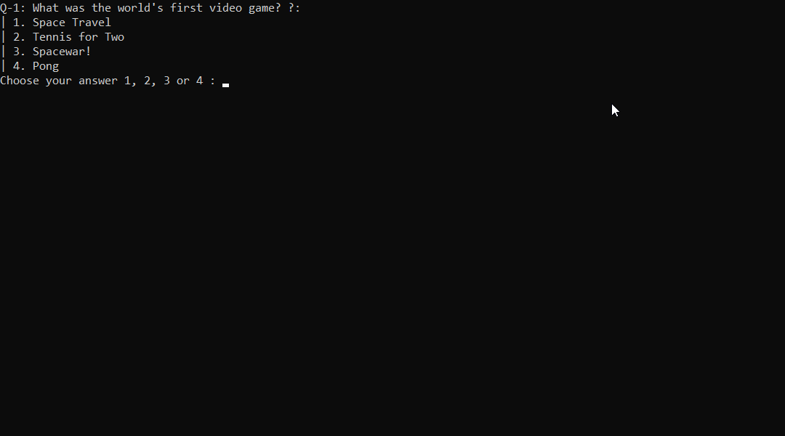
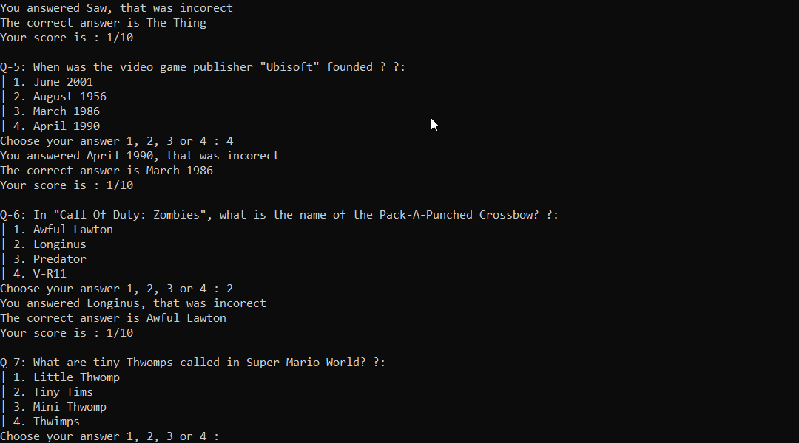

# CLI Quiz Game in Python

## Description

This is a basic quiz game that brings in Data from OpenTriviaDB via the URL API. The game then proceeds to ask you some multiple choice questions, and displays 4 possible answers that you can choose from. You then choose a answer between 1 and 4, if you answer correctly your score will be incremented and you will proceed to the next question.
If you answer incorectly a message will be displayed along with the correct answer to the question.

At the moment the quiz has to brought in manually from the OpenTriviaDB via the data.py file and has to be multiple choice as in below url extract from data.py.

    url = 'https://opentdb.com/api.php?amount=10&category=15&type=multiple'

While I know that there is not ideal it is just meant to demonstate some object orientated porgramming in action.

## How to Use/Run

This was writen in Python 3.10 so should run fine on your system if you have python 3.10 installed

Simply run main.py

### Additional modules needed

- Requests Python Library

### Screenshots

### Game Features

### Files Included

> Question_model.py
>
> - This is a basic object that takes to Properties
>   - Question and Answer

> Quiz_brain.py
>
> - Has 3 Properties and 2 Public Methods and 1 Private method
>   - Public Method - still_has_questions -> bool
>   - Public Method - next_question -> void
>   - Private Method - check_answer ->void

> data.py
>
> - Contains 1 list, containing all the questions and answers in Dictionaries

> main.py
>
> - Main Quiz game loop
